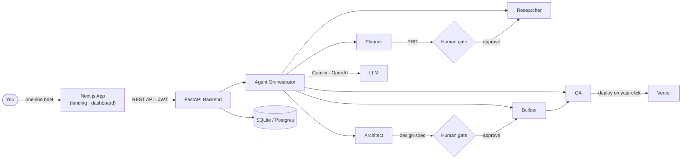

<p align="center">
  
</p>

<h1 align="center">ShipGen — Multi-Agent SDLC Pipeline</h1>

<p align="center">
  <strong>Live Deployed Link:</strong> <a href="https://ship-gen.vercel.app/">ship-gen.vercel.app</a>
</p>

<p align="center">
  <strong>Demo Video Link:</strong> <a href="https://tinyurl.com/yxr3dtnw">tinyurl.com/yxr3dtnw</a>
</p>

<p align="center">
  <em>Describe a product. A crew of specialized AI agents plans, researches, designs, builds and QA-checks it — pausing at every gate for your approval.</em>
</p>

<p align="center">
  
  
  
  
  
  
  
  
</p>

---

## Overview

ShipGen turns a one-line product brief into a working, deployable application. Instead of a single autopilot, a **crew of five specialized agents** runs a software development lifecycle pipeline — and **you** are the human-in-the-loop who approves every critical gate.

No tokens are spent on design or code until you have read and approved the requirements. Nothing goes live until you click deploy.

---

## Architecture



**Flow:** You describe a product → the Planner drafts a PRD → **you approve** → the Researcher scans the market → the Architect produces a design spec → **you approve** → the Builder generates real code → QA runs a checklist → **you trigger the deploy** to Vercel.

---

## Features

- **Five-agent pipeline** — Planner → Researcher → Architect → Builder → QA, each handing a typed artifact to the next
- **Human-gated by design** — hard gates on PRD, design and deploy; agents never ship alone
- **Real artifacts** — PRD, competitive analysis, architecture & design specs, code summaries and QA reports
- **Bring your own model keys** — Gemini or OpenAI, per-user, stored encrypted; a free Gemini tier is built in
- **One-click deploys** — deploy to Vercel with your own token, only when you say so
- **Clerk authentication** — Google, GitHub or email + password
- **Token transparency** — every step reports tokens in/out so the crew stays honest

---

## Tech Stack

| Layer | Technology |
|---|---|
| Frontend | Next.js 15 (App Router), React 19, TypeScript, Tailwind CSS 4 |
| Backend | FastAPI, SQLAlchemy, Pydantic v2, Uvicorn |
| Auth | Clerk (frontend) + JWT verification (backend) |
| Database | SQLite (local) — Postgres-ready via `db_url` |
| LLM | Google Gemini (default) / OpenAI, `google-genai` + `openai` SDKs |
| Deploy | Vercel (user-provided token) |

---

## Getting Started

### Prerequisites

- Python 3.13+
- Node.js 20+
- (Optional) A [Clerk](https://clerk.com) app for social/email auth
- (Optional) A Gemini or OpenAI API key

### 1. Backend

```bash
cd backend
python -m venv .venv

# Windows
.venv\Scripts\activate
# macOS / Linux
source .venv/bin/activate

pip install -r requirements.txt
cp .env.example .env        # fill in your values
uvicorn app.main:app --reload --port 8000
```

The API is now at `http://localhost:8000` — interactive docs at [`/docs`](http://localhost:8000/docs).

### 2. Frontend

```bash
cd frontend-next
npm install
cp .env.example .env.local  # fill in Clerk keys + API URL
npm run dev
```

Open [http://localhost:3000](http://localhost:3000).

> **No keys?** The system still runs — the operator-provided Gemini key powers the free tier, and users can add their own keys in Settings.

---

## Environment Variables

### Backend (`backend/.env`)

| Variable | Description | Default |
|---|---|---|
| `db_url` | Database connection string | `sqlite:///./data/app.db` |
| `jwt_secret` | Secret for legacy JWT auth | `change-me` |
| `gemini_api_key` | Operator Gemini key (free tier) | — |
| `default_model_provider` | `gemini` or `openai` | `gemini` |
| `default_model_name` | Default model | `gemini-3.6-flash` |
| `llm_min_interval_seconds` | Rate-limit safety (free tier ~15 RPM) | `4.0` |
| `workspace_root` | Where generated projects live | `./workspace` |
| `cors_origins` | Allowed frontend origins | `http://localhost:3000` |
| `clerk_issuer` | Clerk frontend API origin (enables Clerk JWT verification) | — |

### Frontend (`frontend-next/.env.local`)

| Variable | Description |
|---|---|
| `NEXT_PUBLIC_API_URL` | Base URL of the FastAPI backend |
| `NEXT_PUBLIC_CLERK_PUBLISHABLE_KEY` | Clerk publishable key |
| `CLERK_SECRET_KEY` | Clerk secret key |

---

## API Overview

| Method | Endpoint | Description |
|---|---|---|
| `GET` | `/health` | Service health + default model info |
| `POST` | `/auth/register` | Create account (email + password) |
| `POST` | `/auth/login` | Get JWT |
| `POST` | `/projects` | Create a project from a brief |
| `GET` | `/projects` | List your projects |
| `GET` | `/projects/{id}` | Project detail + artifacts |
| `POST` | `/projects/{id}/start` | Kick off the agent pipeline (background) |
| `GET` | `/projects/{id}/approvals` | Gate statuses |
| `POST` | `/projects/{id}/approve/{gate}` | Approve a gate (`prd` / `design`) |
| `POST` | `/projects/{id}/deploy` | Trigger a Vercel deploy |
| `GET/PUT` | `/settings` | Per-user model config (encrypted keys) |

---

## Project Structure

```
ship-gen/
├── backend/                  # FastAPI service
│   ├── app/
│   │   ├── agents/           # Agent crew (orchestrator, builder, deployer, prompts…)
│   │   ├── routes/           # auth, projects, deploy, settings
│   │   ├── main.py           # App entrypoint
│   │   ├── models.py         # SQLAlchemy models (users, projects, runs, approvals)
│   │   ├── schemas.py        # Pydantic schemas
│   │   ├── clerk_auth.py     # Clerk JWT verification
│   │   ├── llm.py            # Gemini / OpenAI client
│   │   └── security.py       # Password hashing, encryption
│   └── requirements.txt
└── frontend-next/            # Next.js app
    ├── app/                  # App Router pages (landing, dashboard, projects, settings)
    ├── components/           # UI + landing sections
    └── lib/                  # API client, types, Clerk config
```

---

## Contributing

1. Fork the repository
2. Create a feature branch (`git checkout -b feat/your-feature`)
3. Commit your changes (`git commit -m "feat: add your feature"`)
4. Push to the branch (`git push origin feat/your-feature`)
5. Open a Pull Request

Please keep the human-gate philosophy intact — agents draft, humans decide.

---

## License

Distributed under the [MIT License](LICENSE).

---

## Authors

**Udita Chakraborty** — [@udii05](https://github.com/udii05)

**Asmita Chakraborty** — [@asmitachakrab](https://github.com/asmitachakrab)

<p align="center">
  <sub>Built with a crew of agents — and a captain.</sub>
</p>
